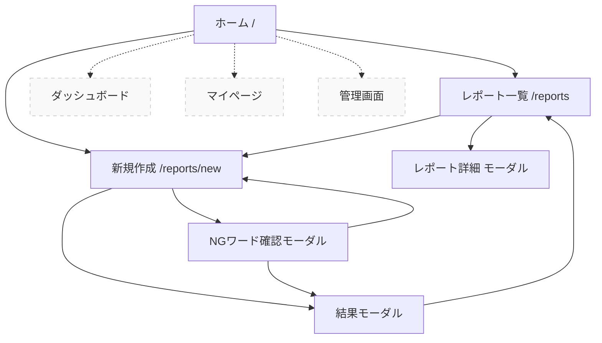

# 画面設計書

## 概要

Incident Report System の画面設計仕様書です。SES 会社の社内利用を目的としたインシデント管理システムの各画面について詳細に記述します。

## 画面一覧

### 1. ホーム画面 (`/`)

**目的**: システムの概要紹介と主要機能へのナビゲーション

**主要 UI 要素**:

- ヒーローセクション（システム名、説明文）
- アクションボタン（新規レポート作成、レポート一覧）
- 機能紹介カード（AI 自動分析、自動匿名化、高度な検索）
- 統計情報（総レポート数、今月のレポート、人気カテゴリ、匿名化処理率）
- CTA セクション

**バリデーション・ユースケース**:

- 正常系: 統計データの表示、各機能への遷移
- 異常系: 統計データ取得失敗時のフォールバック表示

### 2. レポート一覧画面 (`/reports`)

**目的**: 登録されたインシデントレポートの検索・閲覧

**主要 UI 要素**:

- ページヘッダー（タイトル、新規作成ボタン）
- フィルターセクション（カテゴリ、期間、キーワード検索）
- レポートカード一覧（タイトル、要約、カテゴリ、タグ、作成日時）
- ページネーション（簡易版：さらに読み込むボタン）
- 空状態表示

**バリデーション・ユースケース**:

- 正常系: フィルター機能、検索機能、詳細表示
- 異常系: データ取得エラー、検索結果 0 件の表示

### 3. レポート詳細画面（モーダル）

**目的**: 個別レポートの詳細情報表示

**主要 UI 要素**:

- モーダルヘッダー（タイトル、閉じるボタン）
- メタ情報（作成日時、カテゴリバッジ）
- 本文表示エリア
- AI 分析結果（要約、タグ、匿名化処理情報）

**バリデーション・ユースケース**:

- 正常系: 詳細情報の表示、モーダルの開閉
- 異常系: データ取得失敗時のエラー表示

### 4. レポート新規作成画面 (`/reports/new`)

**目的**: 新しいインシデントレポートの作成

**主要 UI 要素**:

- フォームヘッダー
- タイトル入力フィールド（必須、200 文字制限）
- 本文入力エリア（必須、5000 文字制限）
- 送信ボタン（バリデーション付き）
- キャンセルボタン
- 結果表示モーダル（AI 分析結果）
- NG ワード確認モーダル（匿名化確認）

**バリデーション・ユースケース**:

- 正常系: 入力バリデーション、AI 処理、保存完了
- 異常系: 必須項目未入力、文字数制限超過、AI 処理エラー、保存失敗

### 5. ダッシュボード画面（未実装）

**目的**: インシデントデータの可視化と分析

**主要 UI 要素**:

- カテゴリ分布グラフ
- 時系列グラフ
- 上位タグランキング
- AI 所感（一段落のまとめ）

### 6. マイページ（未実装）

**目的**: ユーザー個人の活動状況表示

**主要 UI 要素**:

- 提出数、ポイント表示
- 獲得バッジ
- マスコット表示（成長段階）

### 7. 管理画面（未実装）

**目的**: システム管理者向け設定画面

**主要 UI 要素**:

- 禁止ワードリスト編集
- 監査ログ確認
- ユーザー管理

## 画面遷移図

## レスポンシブ対応

### ブレークポイント

- モバイル: `< 640px`
- タブレット: `640px - 1024px`
- デスクトップ: `> 1024px`

### 対応方針

- Tailwind CSS のレスポンシブクラスを使用
- モバイルファーストアプローチ
- 主要機能はすべてのデバイスで利用可能

## アクセシビリティ

### 対応項目

- キーボードナビゲーション対応
- スクリーンリーダー対応（aria-label 等）
- 適切なコントラスト比の確保
- フォーカス表示の明確化

## パフォーマンス考慮事項

### 最適化項目

- 画像の遅延読み込み
- 無限スクロール（ページネーション）
- API 呼び出しのデバウンス処理
- コンポーネントの適切な分割

## 今後の拡張予定

### v2.0 での追加機能

- ダッシュボード画面の実装
- マイページ機能
- 管理画面の実装
- 高度な検索機能
- レポートのお気に入り機能
- コメント・評価機能
